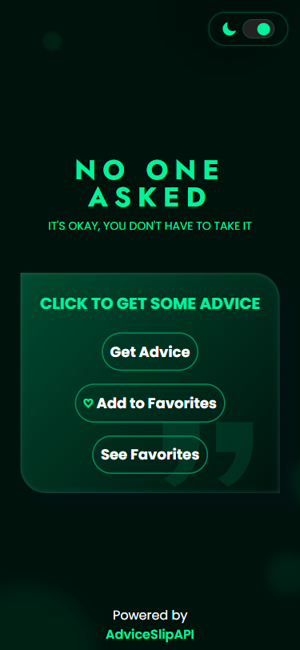
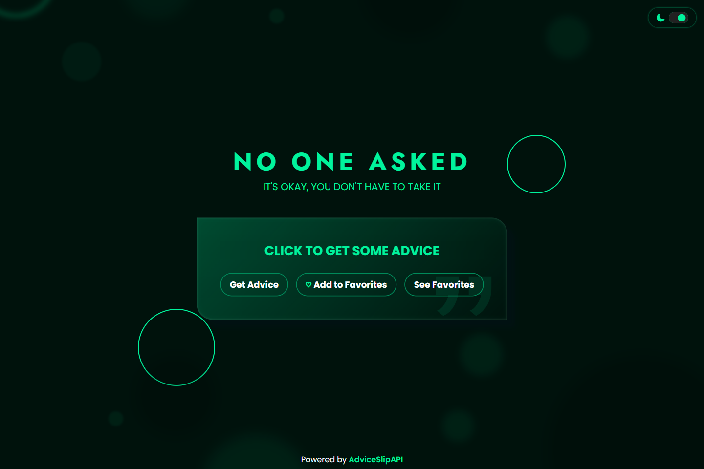
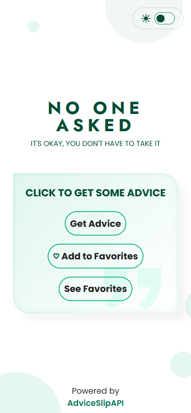
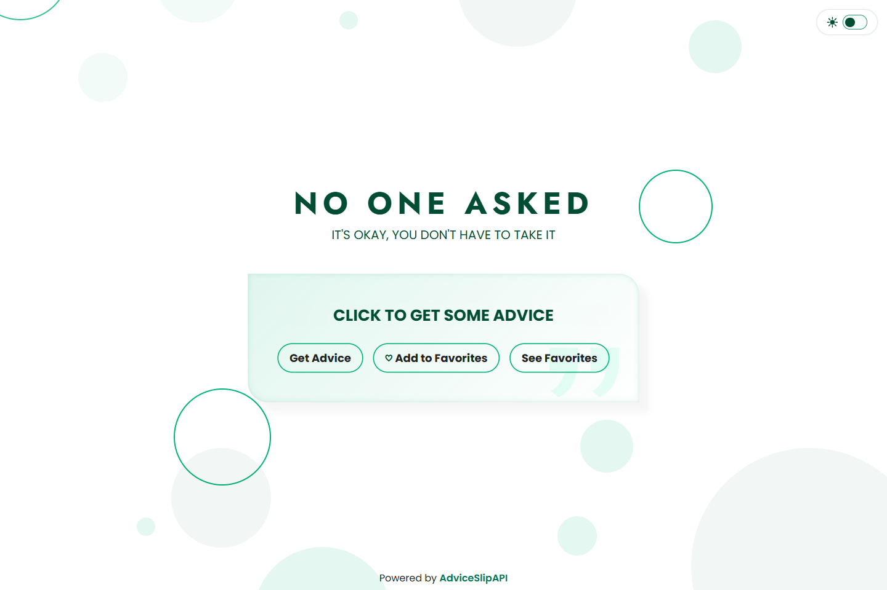

# 💻 No One Asked

## ℹ️ No One Asked - A Random Advice Generator Inspired From a FreeCodeCamp Lab Challenge

| _Mobile Preview (375x812)_                                   | _Desktop Preview (1440x960)_                                    |
| ------------------------------------------------------------ | --------------------------------------------------------------- |
|  |  |
|       |       |

This project is a random advice generator powered by the [Advice Slip API](https://api.adviceslip.com/) where users can click the floating button to fetch humorous or thoughtful advice, styled in a sleek modern UI with responsive layout, theme toggle support, and dynamic transitions.

Created and inspired from the favorite icon toggler lab challenge of the [**freeCodeCamp.org**](https://www.freecodecamp.org/learn/full-stack-developer/) JavaScript course.

---

## 🔍 Overview

This web app fetches and displays random advice using the [Advice Slip API](https://api.adviceslip.com/). The interface is minimalistic yet dynamic and is centered around a group of interactive buttons and an advice card that refreshes on click.

The site also saves the user's favorites via dynamic updates in their browser's `localStorage` whenever they get advice, add it to favorites or even when they just want to see the list of their favorite advices. These saved favorites can also be shared on Twitter, copied, and even removed from the favorite list.

---

## ✨ Features

- Fetch random advice from the Advice Slip API
- Theme toggle (light/dark mode) with persistent `localStorage` support
- Responsive layout (mobile-first)
- Adaptive background design based on theme
- Accessible ARIA live region for screen reader announcements
- Button loading updates for user feedback
- Modular JavaScript structure
- Dynamic content with save features, direct share buttons, copy and delete features
- Lighthouse-audited for performance and accessibility

---

## 🧠 What I Learned

- This is my first time in trying JavaScript using ES modules via `import` and `export`
- First time using a public API and producing dynamic DOM updates by using `async`, `await` and `fetch()`
- First time applying `aria-live` for accessible screen reader updates
- Created a near perfect copy of a free [Figma design file](https://www.figma.com/community/file/1332877965616249757/free-section-design-testimonials)
- Strengthened my grasp on how to store and retrieve preferences and data from `localStorage`
- Gained more experience in managing CSS transitions across dark/light modes
- Better separation of concerns through modules and semantic HTML

---

## 🛠️ Tech Used

- HTML5
- CSS3
- JavaScript
- Git
- GitHub
- Netlify

---

## 🎨 Design Reference & Tools

- Figma

---

## 🚀 How to Run

1. Clone the repository
2. Open `index.html` in your browser

---

## 🌐 Live Demo

Or you can check out the 👉 [live website here](LINK)

---

## 📊 Performance Report

A **Google Lighthouse** audit was conducted on the final version of this project. You can view the full report [here](./assets/downloads/lighthouse-performance-report.pdf).

---

## 🧑‍💻 Author

Created by **Elmar Chavez**

🗓️ Month/Year: **August 2025**

📚 Journey: **5th** month of learning _frontend web development_.

<!--

FREECODECAMP TAGS:
html css javascript vscode git github netlify 4th-month freecodecamp project lighthouse theme-toggle fcc-js fetch-api

-->
